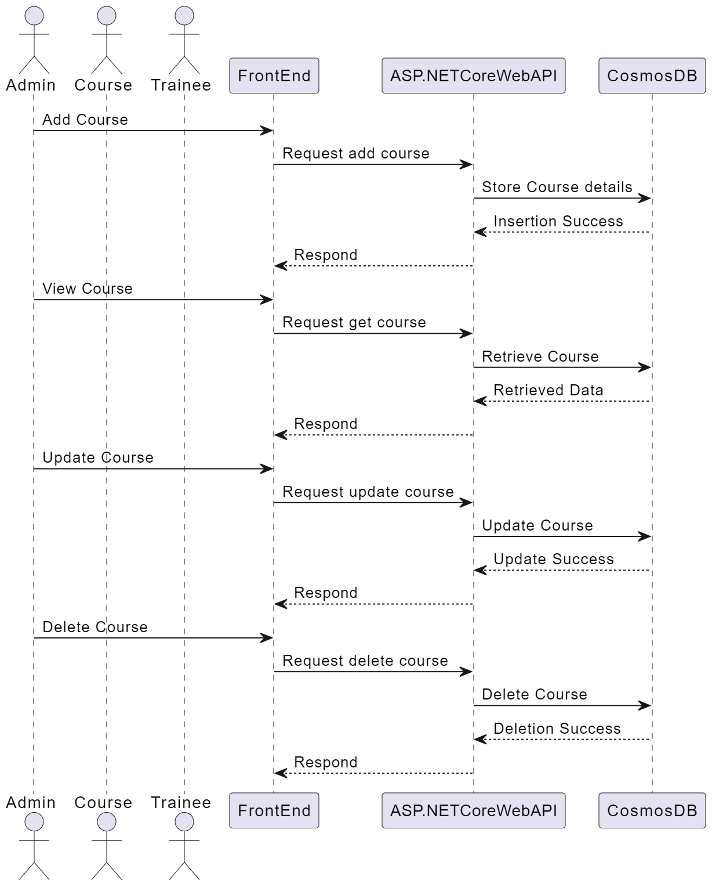
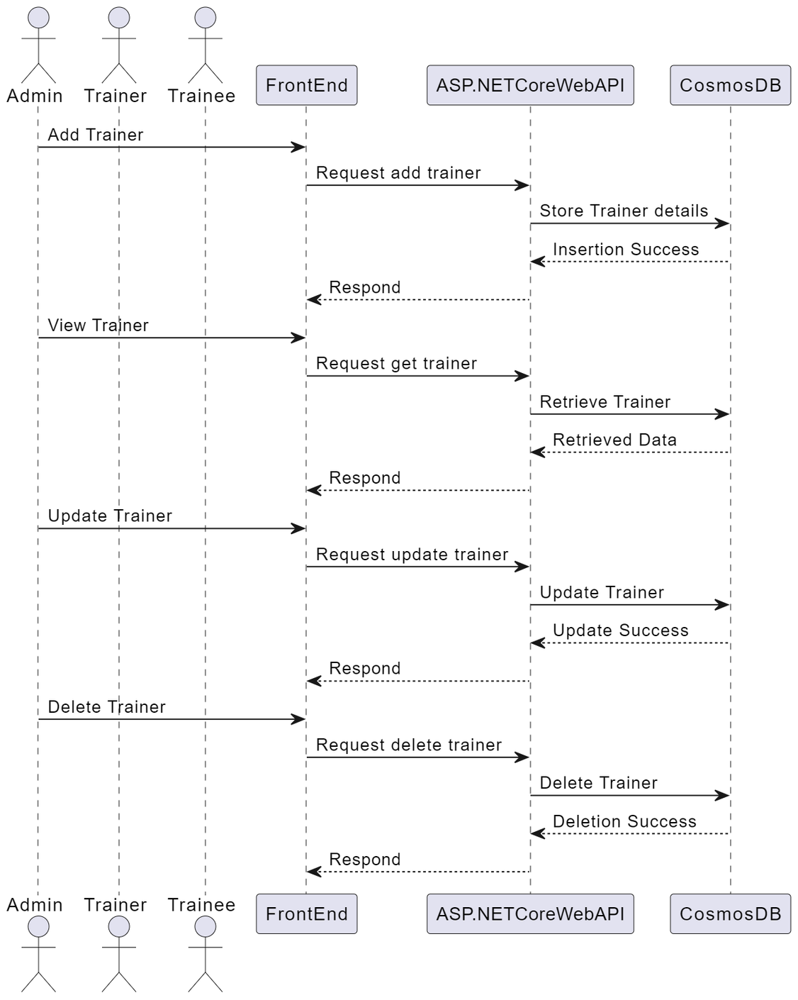
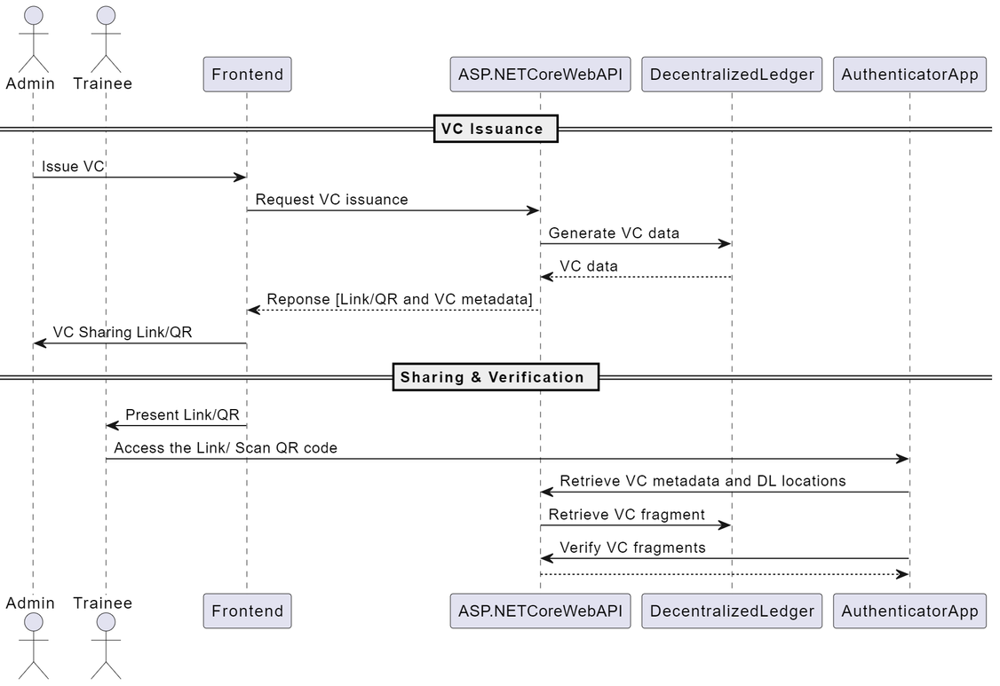
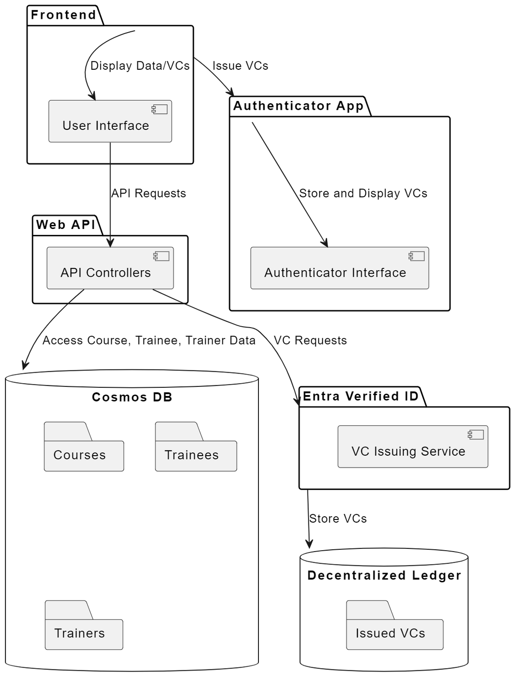

# Project Migration Documentation: Version 1

## Overview

The project migration will be conducted version by version. The initial version will integrate the Self-Sovereign Identity concept using Verifiable Credentials for Academic Credentials. Therefore, the previous CRUD functionalities related to courses, trainees, and trainers will remain at the same stage but will migrate from Azure Functions to ASP.NET Core Web API. The certificate issuer part is migrating as a Verified ID, Verifiable Credentials.

## Sequence Diagrams

### Course

### Trainee

### Trainer

### Certificates - VC

## Definitions

- **DID:** Decentralized Identifier
- **VC:** Verifiable Credentials
- **Fragments:** In the context of storing verified credentials (VCs) with fragments, the term "fragments" refers to splitting the VC data into smaller pieces and storing them on different Decentralized Ledgers (DLs).

## High-Level Architecture Diagram

